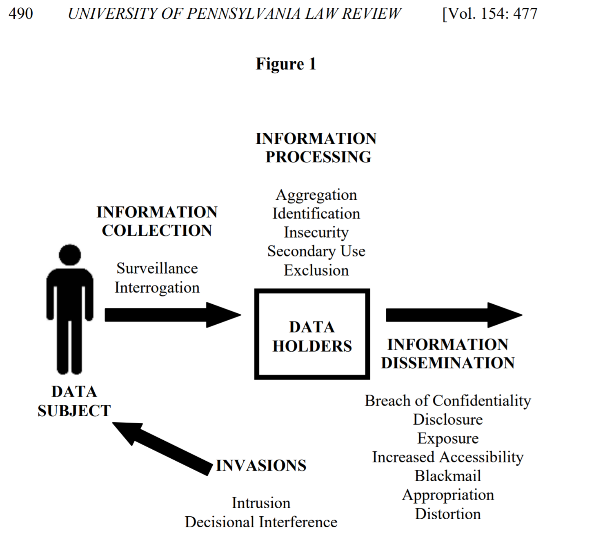

The word _privacy_ can mean many things and researchers, policymakers, and the public can talk past each other when we use it to mean different things.

This paper gives people who work in privacy a common lexicon for privacy harms.

> In the taxonomy that follows, there are four basic groups of harmful activities:
>
>  1. information collection, 
>  2. information processing, 
>  3. information dissemination, and 
>  4. invasion.

  